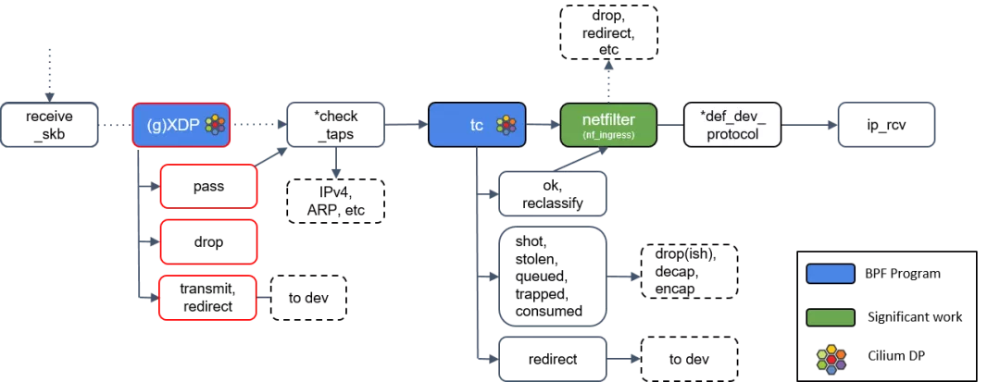

# Working Principle of dae

[**简体中文**](../zh/how-it-works.md) | [**English**](./how-it-works.md)

dae operates by loading a program into the tc (traffic control) mount point in the Linux kernel using [eBPF](https://en.wikipedia.org/wiki/EBPF). This program performs traffic splitting before the traffic enters the TCP/IP network stack. The position of tc in the Linux network protocol stack is shown in the diagram below (the diagram illustrates the receiving path, while the sending path is in the opposite direction), where netfilter represents the location of iptables/nftables.

## Traffic Splitting Principle

### Splitting Information

dae supports traffic splitting based on domain name, source IP, destination IP, source port, destination port, TCP/UDP, IPv4/IPv6, process name, MAC address, and other factors.

Among them, source IP, destination IP, source port, destination port, TCP/UDP, IPv4/IPv6, and MAC address can be obtained by parsing MACv2 frames.

The **process name** is obtained by listening to local process socket, connect, and sendmsg system calls in the cgroupv2 mount point and reading and parsing the command line from the process control block. This method is much faster than user-space programs like Clash that scan the entire procfs to obtain process information (the latter may take even tens of milliseconds).

The **domain name** is obtained by intercepting DNS requests and associating the requested domain name with the corresponding IP address. Although this method has some issues:

1. It may lead to misjudgment. For example, if two websites, one domestic and one foreign, share the same IP address and are accessed simultaneously within a short period of time, or if the browser has DNS caching.
2. The user's DNS requests must go through dae. For example, setting dae as the DNS server or using public DNS while dae is acting as the gateway.

However, compared to other solutions, this approach is already an optimal solution. For example, the Fake IP approach cannot perform IP-based splitting and suffers from severe cache pollution issues, while the domain sniffing approach can only sniff traffic such as TLS/HTTP. In fact, using SNI sniffing for traffic splitting is indeed a better choice, but due to eBPF's limitations on program complexity and its lack of friendly support for loops, we cannot implement domain sniffing in the kernel space.

Therefore, when DNS requests cannot go through dae, domain-based splitting will fail.

> To reduce DNS pollution and achieve better CDN connection speed, dae implements domain sniffing in user space. When `dial_mode` is set to "domain" or its variants and the traffic needs to be proxied, dae sends the sniffed domain to the proxy server instead of sending the IP address. This way, the proxy server will re-resolve the domain and connect using the optimal IP, thereby solving the problem of DNS pollution and achieving better CDN connection speed.
>
> At the same time, for advanced users who have already used other splitting solutions and do not want to route DNS requests through dae but still want the part of the traffic to be split based on domain (e.g., splitting some traffic to Netflix nodes and some to download nodes based on the target domain, of course, some can be directly connected via the core), they can force the use of sniffed domain for splitting by setting `dial_mode: domain++`.

dae performs traffic splitting by redirecting the traffic using the program in the tc mount point. The redirection is based on the splitting result, either redirecting the traffic to dae's tproxy port or allowing it to bypass dae and go directly.

### Proxy Principle

The proxy principle of dae is similar to other programs. The difference is that when binding to the LAN interface, dae uses eBPF to directly associate the socket buffer of the traffic to be proxied in the tc mount point with the socket of dae's tproxy listening port. When binding to the WAN interface, dae moves the socket buffer of the traffic to be proxied from the egress queue of the network card to the ingress queue, disables its checksum, and modifies the destination address to the tproxy listening port.

In terms of benchmarking, dae's proxy performance is slightly better than other proxy programs, but not by much.

### Direct Connection Principle

Traditionally, in order to perform traffic splitting, the traffic needs to go through a proxy program, go through the splitting module, and then decide whether to go through a proxy or be directly connected. This involves parsing, processing, and copying the traffic through the network stack, passing it to the proxy program, and then copying, processing, and encapsulating it through the network stack before sending it out, which consumes a significant amount of resources. Especially for scenarios like BitTorrent downloads, even if direct connection is set, it still consumes a large number of connections, ports, memory, and CPU resources. It can even affect NAT type in gaming scenarios due to improper handling by the proxy program, resulting in connection errors.

dae performs traffic splitting at an earlier stage in the kernel, and directly connected traffic is forwarded through layer 3 routing, saving a significant amount of overhead from transitioning between kernel and user space. At this stage, Linux behaves like a pure switch or router.

> To make direct connection effective, for users with advanced topologies, please ensure that after configuring the [kernel parameters](user-guide/kernel-parameters.md) and **disabling** dae, other devices can access the network normally when the device where dae is located is set as the gateway. For example, accessing 223.5.5.5 should receive a "UrlPathError" response, and when performing tcpdump on the device where dae is located, you should be able to see the request packets from client devices.

Therefore, for directly connected traffic, dae does not perform SNAT. For users with a "side-router" setup, this will result in asymmetric routing, where traffic from client devices is sent through dae to the gateway when being sent out, but is directly sent from the gateway to the client devices when being received, bypassing dae.

> Here, "side-router" is defined as: 1) acting as the gateway, 2) performing SNAT on TCP/UDP, and 3) having the LAN interface and WAN interface in the same network segment.
>
> For example, if the laptop is at 192.168.0.3, the side-router is at 192.168.0.2, and the router is at 192.168.0.1, the logical three-layer topology would be: laptop -> side-router -> router. On the router side, only TCP/UDP traffic with a source IP of 192.168.0.2 can be seen, and there will be no TCP/UDP traffic with a source IP of 192.168.0.3.
>
> As far as we know, we are the first to define "side-router" like this (laughs).

Asymmetric routing brings one advantage and one potential issue:

1. It can improve performance. Since the return traffic does not pass through dae, the direct connection performance becomes as fast as without a side-router, as the path is reduced.
2. It may cause the failure of stateful firewall's state maintenance and result in packet loss (e.g., Sophos Firewall). However, this issue generally does not occur in home networks

From a benchmark perspective, the direct connectivity performance of dae is like a beast compared to other proxy.
