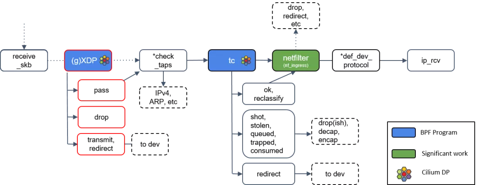

# Working Principle of dae

[**简体中文**](../zh/how-it-works.md) | [**English**](./how-it-works.md)

dae uses [eBPF](https://en.wikipedia.org/wiki/EBPF) to load a program at the Linux
kernel's tc (traffic control) hook. The program splits traffic before it enters
the TCP/IP network stack.

The diagram shows tc's position on the receive path; the send path runs in the
opposite direction. netfilter marks the location of iptables/nftables.

## Traffic Splitting Principle

### Splitting Criteria

dae supports traffic splitting based on domain name, source IP, destination IP, source port, destination port, TCP/UDP, IPv4/IPv6, process name, MAC address, and other factors.

| Criterion | Source |
| --- | --- |
| Source and destination IP, source and destination port, TCP/UDP, IPv4/IPv6, MAC address | Parsed from MACv2 frames |
| Process name | Local `socket`, `connect`, and `sendmsg` system calls monitored at the cgroupv2 hook; the command line is read and parsed from the process control block |
| Domain name | Intercepted DNS requests associate the requested domain with its IP address |

Obtaining process names this way is significantly faster than scanning all of
procfs, as userspace programs such as Clash do. A full procfs scan can take tens
of milliseconds.

Associating domains with DNS responses has two limitations:

- It can misclassify traffic. For example, a domestic and a foreign website may
  share an IP address and be accessed close together, or the browser may cache DNS.
- DNS requests must pass through dae. Set dae as the DNS server, or use a public
  DNS server with dae as the gateway.

Despite these limitations, this approach remains preferable to the alternatives.
Fake IP cannot support IP-based splitting and has severe cache pollution issues.
Domain sniffing can only inspect traffic such as TLS, HTTP and QUIC. SNI
sniffing can support traffic splitting, but eBPF's program complexity limits
keep domain sniffing in userspace. The eBPF program itself uses `bpf_loop` for
rule matching and process-name parsing, which is why dae requires kernel 5.17
or later.

Without DNS requests passing through dae, DNS-based domain splitting cannot work.

TCP sniffing has a time limit. `sniffing_timeout` (30ms by default) and
`dial_mode: ip` govern only TCP sniffing and the automatic sniff-punt lines. dae
first waits up to `sniffing_timeout` for the first 16 bytes of the client's TCP
payload. If none arrive, or they do not look like a TLS handshake or an HTTP
request, dae uses IP-based splitting. Otherwise dae starts a sniffer with a
fresh `sniffing_timeout` deadline and keeps reading TCP segments until the TLS
ClientHello is complete or the deadline passes, so the SNI need not be in the
first segment. dae checks HTTP once, in the bytes already read. If dae finds no
domain, it falls back to IP-based splitting. dae never sniffs TCP to destination
ports 20, 21, 22, 25, 53, 119, 123, 161, 3306, 5432, 6379, 9200, 27017 and
11211.

UDP sniffing ignores `sniffing_timeout` and `dial_mode: ip`. dae sniffs a UDP
packet only when its source or destination port is 443 or 8443 and the packet
looks like a QUIC Initial. dae holds such packets in a per-connection (DCID)
sniffer until it parses the SNI, bounded by a 5-second session TTL. Under
`dial_mode: ip` dae does not use the sniffed QUIC domain to choose the dial
target.

For TCP, after 3 consecutive sniff failures for the same flow signature
(destination address and port, process name, MAC address and DSCP), dae skips
sniffing that signature for 10 minutes. This negative cache prevents repeated
attempts to match a domain on every connection when the flow never carries one
at its start. A successful sniff clears the entry. UDP uses a separate per-DCID
policy. Four consecutive no-SNI results pause sniffing for one second. Two
consecutive decrypt failures give up on that DCID. dae then bypasses a failed
DCID for 15 seconds (no SNI), 30 seconds (decrypt failure) or 1 minute (sniffer
panic), doubling on repeat up to a 5-minute cap.

When a device's domain whitelist is combined with that device's encrypted DNS,
dae inserts its own kernel-space sniff fallback. This keeps the whitelist
working even when the device's DNS never reaches dae, but only for connections
dae can sniff. Those are TCP connections outside the excluded ports above with a
TLS or HTTP first segment, and UDP on port 443 or 8443 carrying a QUIC Initial.
When dae skips a punted connection or finds no domain, it re-routes the
connection without a domain, so the connection takes the device's selector-only
fallback, still relayed through userspace. See `auto_sniff_punt` in
[routing](configuration/routing.md).

> dae sniffs domains in userspace to mitigate DNS pollution and improve CDN
> connection speeds. With `dial_mode: domain` (the default), dae sends the
> sniffed domain to the proxy server instead of the IP address only in two
> cases. Either dae's DNS cache already holds an `A` or `AAAA` record for that
> domain, or an earlier background probe confirmed that the domain resolves. On
> the first connection to an unknown domain, dae dials the original IP and
> starts a background probe through `bootstrap_resolver`. dae caches a name with
> no answer as negative for 10 seconds. `domain+` and `domain++` skip this check
> and always send the sniffed domain. The proxy server resolves the domain again
> and connects to the optimal IP address.
>
> Advanced users with other splitting solutions can set `dial_mode: domain++`
> to force routing by sniffed domain without sending DNS requests through dae.
> For example, this can route Netflix and download traffic to different nodes
> by target domain, with some traffic connecting directly through the core.

The tc program uses the splitting result to redirect traffic to dae's tproxy
port or let it bypass dae and connect directly.

### Proxy Mechanism

dae's proxy mechanism is similar to that of other proxy programs:

| Binding | Packet handling |
| --- | --- |
| LAN | At tc ingress on the bound interface, eBPF rewrites only the Ethernet header (destination MAC set to `dae0peer`), records the flow in `redirect_track`, and sets `skb->cb[0]` to `TPROXY_MARK` (`0x8000000`). It then redirects the unchanged IP packet into `dae0` with `bpf_redirect`. On a netkit pair with a kernel that carries the CVE-2025-37959 fix (mainline 6.14.7 or later), it skips the MAC rewrite and uses `bpf_redirect_peer` instead. |
| WAN | At tc egress on the bound interface, eBPF applies the same MAC rewrite, `redirect_track` entry and cb mark, then calls `bpf_redirect` into `dae0`. Replies come back through `dae0` ingress, which restores the original MACs and redirects them to the interface's ingress queue with `BPF_F_INGRESS`. |

Both paths keep the destination address, ports and checksums intact. dae's
tproxy listener runs on `tproxy_port` (default 12345) inside the `daens` network
namespace. At `dae0peer` ingress, eBPF drops packets without the cb mark. eBPF
sets `skb->mark` to `0x8000000` so the policy rule
`fwmark 0x8000000/0x8000000 table 2023` delivers the packets to
`local default dev lo`. eBPF then calls `bpf_sk_assign` to attach UDP datagrams
and TCP SYNs to the listener. Established TCP segments reach the socket through
that local route without an assignment.

Benchmarks show slightly higher proxy performance than other proxy programs,
but the difference is small.

Since [PR: implement stack bypass](https://github.com/daeuniverse/dae/pull/458),
the hijack datapath bypasses the stack to improve performance and reduce the
influence of components such as netfilter and systemd-sysctl. See the PR description.

### Direct Connection Mechanism

Conventional traffic splitting sends traffic through a proxy program before
deciding whether to proxy it or connect directly. The network stack parses,
processes, and copies traffic to the proxy program, then copies, processes,
and encapsulates it again for transmission.

This consumes resources even for direct connections. BitTorrent downloads can
use many connections, ports, memory, and CPU resources. In games, inadequate
handling by the proxy program can affect NAT type and cause connection errors.

dae splits traffic earlier in the kernel and forwards direct traffic through
layer 3 routing. Fewer transitions between kernel and userspace reduce overhead.
Linux then acts as a switch or router. LAN traffic routed to `direct` always
takes this kernel path, with `skb->mark` set to the rule's mark. For the dae
host's own traffic, only `direct` with mark 0 bypasses the proxy program. dae's
userspace direct dialer, with the mark set as `SO_MARK`, dials connections
matched by `direct(mark: N)` with a non-zero mark, DNS queries to a non-`must`
outbound, and connections that userspace re-routes to `direct` after sniffing.

> For custom network topologies, verify direct connectivity after configuring
> the [kernel parameters](user-guide/kernel-parameters.md) and disabling dae.
> Other devices should be able to access the network with the dae host as their
> gateway. For example, accessing 223.5.5.5 should return "UrlPathError", and
> tcpdump on the dae host should show client request packets.

dae does not perform SNAT on direct traffic. With a side-router, this produces
asymmetric routing: outgoing client traffic passes through dae to the gateway,
but return traffic goes from the gateway directly to the client.

> A side-router acts as a gateway, performs SNAT on TCP/UDP, and has LAN and WAN
> interfaces in the same subnet.
>
> For example, a laptop at 192.168.0.3 connects through a side-router at
> 192.168.0.2 to a router at 192.168.0.1. The logical layer 3 topology is
> laptop -> side-router -> router. The router sees TCP/UDP traffic from
> 192.168.0.2, not from 192.168.0.3.

Asymmetric routing has two effects:

- Return traffic bypasses dae, shortening the path and making direct connections
  as fast as they would be without a side-router.
- It can disrupt state tracking in firewalls such as Sophos Firewall and cause
  packet loss. This generally does not affect home networks.

Benchmarks show higher direct-connection performance than other proxy solutions.
